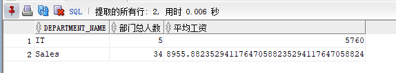
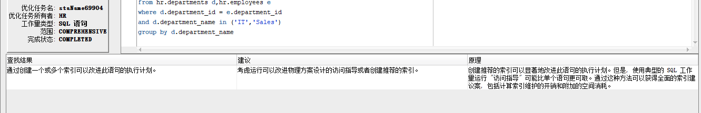

# 实验1： SQL语句的执行计划分析与优化指导

## 实验目的：

分析SQL执行计划，执行SQL语句的优化指导。理解分析SQL语句的执行计划的重要作用。

## 实验内容：

（1）对Oracle12c中的HR人力资源管理系统中的表进行查询与分析。

（2）首先运行和分析教材中的样例：本训练任务目的是查询两个部门('IT'和'Sales')的部门总人数和平均工资，以下两个查询的结果是一样的。但效率不相同。

（3）设计自己的查询语句，并作相应的分析，查询语句不能太简单。

## 实验步骤：

1.运行教材查询语句一

```sql
set autotrace on

SELECT d.department_name,count(e.job_id)as "部门总人数",
avg(e.salary)as "平均工资"
from hr.departments d,hr.employees e
where d.department_id = e.department_id
and d.department_name in ('IT','Sales')
GROUP BY d.department_name;
```

实验截图


2.运行教材语句二

```sql
set autotrace on

SELECT d.department_name,count(e.job_id)as "部门总人数",
avg(e.salary)as "平均工资"
FROM hr.departments d,hr.employees e
WHERE d.department_id = e.department_id
GROUP BY d.department_name
HAVING d.department_name in ('IT','Sales');
```

实验截图：



其中第一条语句最优,优化指导：



自己设计语句：

```sql

SELECT a.total_sql 
FROM WRH$_SQL_SUMMARY a,WRH$_SQL_WORKAREA_HISTOGRAM b
WHERE a.DBID = b.DBID;
```

# 实验总结

这次实验我了解了Oracle的sql语句，对sql语句执行效率有了一定的了解，能通过sqldeveloper的优化指导对sql语句进行一些改进。