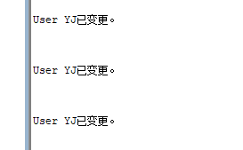
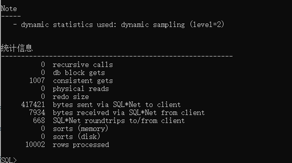
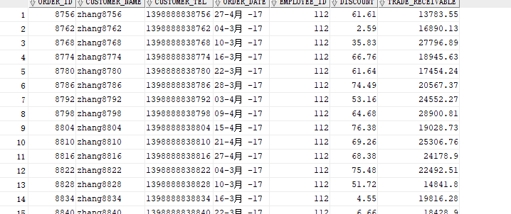
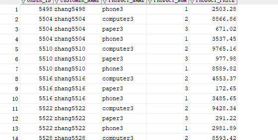
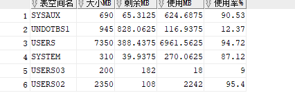

# 实验3：创建分区表

### 实验目的

掌握分区表的创建方法，掌握各种分区方式的使用场景。

### 实验内容

- 本实验使用3个表空间：USERS,USERS02,USERS03。在表空间中创建两张表：订单表(orders)与订单详表(order_details)。

- 使用**你自己的账号创建本实验的表**，表创建在上述3个分区，自定义分区策略。

- 你需要使用system用户给你自己的账号分配上述分区的使用权限。你需要使用system用户给你的用户分配可以查询执行计划的权限。

- 表创建成功后，插入数据，数据能并平均分布到各个分区。每个表的数据都应该大于1万行，对表进行联合查询。

- 写出插入数据的语句和查询数据的语句，并分析语句的执行计划。

- 进行分区与不分区的对比实验。

### 实验步骤

1.修改用户权限

```sql
ALTER USER yj QUOTA UNLIMITED ON USERS;
ALTER USER yj QUOTA UNLIMITED ON USERS02;
ALTER USER yj QUOTA UNLIMITED ON USERS03;
```



2.登录用户并执行test3.sql文件，创建分区表并插入数据



3.对插入数据进行查询

```sql
select * from your_user.orders where order_date
between to_date('2017-1-1','yyyy-mm-dd') and to_date('2018-6-1','yyyy-mm-dd');
```



```sql
select a.ORDER_ID,a.CUSTOMER_NAME,
b.product_name,b.product_num,b.product_price
from yj.orders a,yj.order_details b where
a.ORDER_ID=b.order_id and
a.order_date between to_date('2017-1-1','yyyy-mm-dd') and to_date('2018-6-1','yyyy-mm-dd');
```



4.查询数据库的使用情况

```sql
SELECT a.tablespace_name "表空间名",Total/1024/1024 "大小MB",
 free/1024/1024 "剩余MB",( total - free )/1024/1024 "使用MB",
 Round(( total - free )/ total,4)* 100 "使用率%"
 from (SELECT tablespace_name,Sum(bytes)free
        FROM   dba_free_space group  BY tablespace_name)a,
       (SELECT tablespace_name,Sum(bytes)total FROM dba_data_files
        group  BY tablespace_name)b
 where  a.tablespace_name = b.tablespace_name;
```



