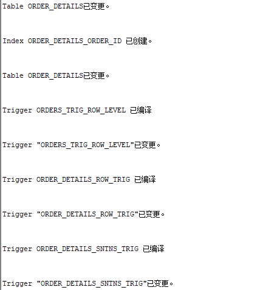
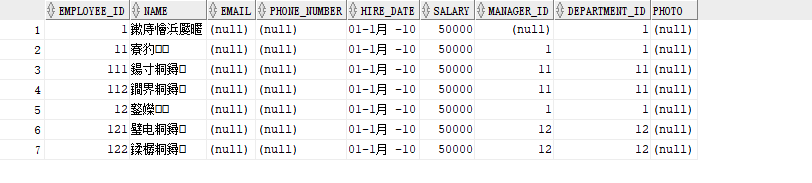
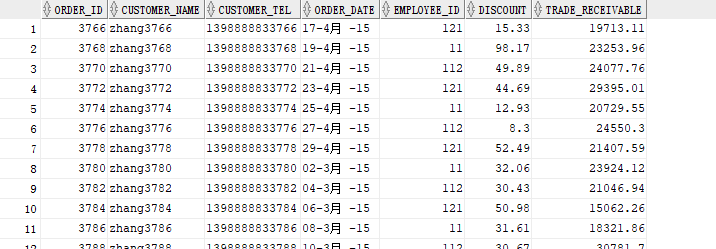
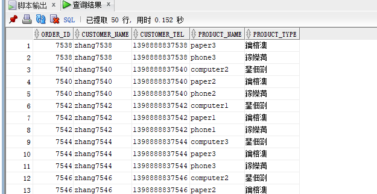
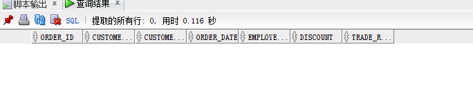
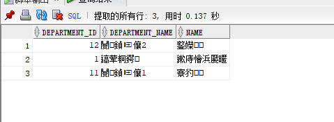
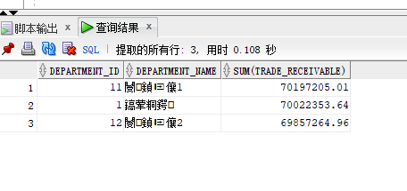

# 实验4：对象管理

## 实验目的

了解Oracle表和视图的概念，学习使用SQL语句Create Table创建表，学习Select语句插入，修改，删除以及查询数据，学习使用SQL语句创建视图，学习部分存储过程和触发器的使用。

## 实验场景

假设有一个生产某个产品的单位，单位接受网上订单进行产品的销售。通过实验模拟这个单位的部分信息：员工表，部门表，订单表，订单详单表。

## 实验内容

### 运行test4.sql



### 数据关系图


### 查询数据

1.查询某员工

```sql
select * from employees where EMPLOYEE_ID = 1;
```

2.递归查2.询某个员工及其所有下属，子下属员工。

```sql
select * from employees start with EMPLOYEE_ID = 1 connect by prior employee_id = manager_id;
```



3.查询订单表，并且包括订单的订单应收货款: Trade_Receivable= sum(订单详单表.ProductNum*订单详单表.ProductPrice)- Discount。

```sql
select * from orders
```



4.查询订单详表，要求显示订单的客户名称和客户电话，产品类型用汉字描述。

```sql
select a.order_id,a.customer_name, a.customer_tel,b.product_name , c.product_type 
from orders a, order_details b, products c
where a.order_id=b.order_id and b.product_name=c.product_name;
```



5.查询出所有空订单，即没有订单详单的订单。

```sql
select * from orders a where a.order_id not in(select b.order_id from order_details b)
```



6.查询部门表，同时显示部门的负责人姓名。

```sql
select a.department_id, a.department_name , b.name from departments a,employees b,
(select department_id, manager_id from employees
where manager_id is not null
group by department_id, manager_id) c
where c.department_id=a.department_id and c.manager_id=b.employee_id;
```



7.查询部门表，统计每个部门的销售总金额。

```sql
select department_id, department_name, sum(trade_receivable) from
(select a.department_id, d.department_name, b.trade_receivable from employees a,orders b,departments d 
where b.employee_id=a.employee_id and d.department_id=a.department_id
group by a.department_id,d.department_name,b.trade_receivable)c
group by department_id,department_name;
```

