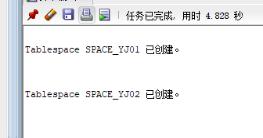
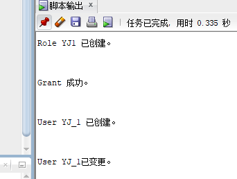
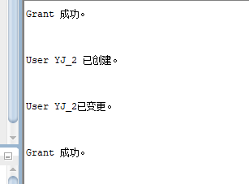
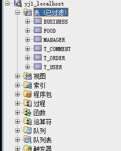
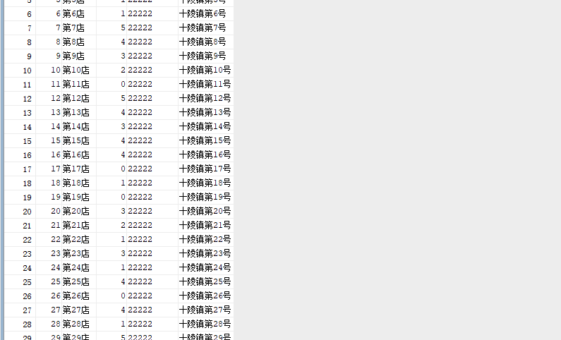
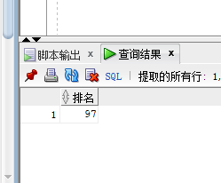
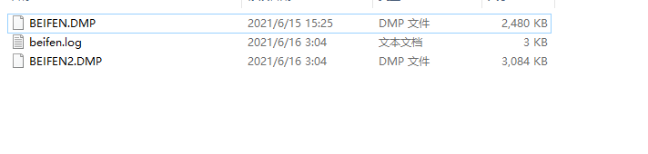

# 实验6(期末考核)：基于Oracle的外卖管理系统数据库设计

## 期末考核要求

- 自行设计一个信息系统的数据库项目，自拟`某项目`名称。
- 设计项目涉及的表及表空间使用方案。至少5张表和5万条数据，两个表空间。
- 设计权限及用户分配方案。至少两类角色，两个用户。
- 在数据库中建立一个程序包，在包中用PL/SQL语言设计一些存储过程和函数，实现比较复杂的业务逻辑，用模拟数据进行执行计划分析。
- 设计自动备份方案或则手工备份方案。
- 设计容灾方案。使用两台主机，通过DataGuard实现数据库整体的异地备份(可选)。

## 系统场景

对外卖进行管理，有商家表、商品表，用户表，订单表，评论表，管理员表。

## 数据库设计

##### 用户表

|   字段    |    类型     | 主键，外键 | 是否可为空 | 默认值 | 约束 |   说明   |
| :-------: | :---------: | :--------: | :--------: | :----: | :--: | :------: |
|    uid    | number(*,0) |    主键    |     否     |        |      |  唯一ID  |
| username  | varchar(20) |            |     否     |        |      |  用户名  |
| password  | varchar(20) |            |     否     |        |      |   密码   |
| telephone | varchar(20) |            |     否     |        |      | 联系方式 |
|  address  | varchar(50) |            |            |        |      |   地址   |

##### 商家表

|   字段    |    类型     | 主键，外键 | 是否可为空 | 默认值 | 约束 |   说明   |
| :-------: | :---------: | :--------: | :--------: | :----: | :--: | :------: |
|    bid    | number(*,0) |    主键    |     否     |        |      |  唯一ID  |
|   bname   |  char(50)   |            |     否     |        |      |   店名   |
|   star    | number(*,0) |            |     否     |        |      |   评分   |
| telephone | varchar(20) |            |     否     |        |      | 联系方式 |
|  address  | varchar(50) |            |     否     |        |      |   地址   |

##### 商品表

| 字段  |    类型     | 主键，外键 | 是否可为空 | 默认值 | 约束 |  说明  |
| :---: | :---------: | :--------: | :--------: | :----: | :--: | :----: |
|  sid  | number(*,0) |    主键    |     否     |        |      | 唯一ID |
|  bid  | number(*,0) |    外键    |     否     |        |      | 商家ID |
| name  | varchar(50) |            |     否     |        |      | 商品名 |
| price | number(*,0) |            |     否     |        |      |  价格  |

##### 管理员表

|   字段   |       类型       | 主键，外键 | 是否可为空 | 默认值 | 约束 |  说明  |
| :------: | :--------------: | :--------: | :--------: | :----: | :--: | :----: |
|   gid    |   number(*,0)    |    主键    |     否     |        |      | 唯一ID |
| password | varchar(50 byte) |            |     否     |        |      |  密码  |
|  power   |   number(*,0)    |            |     否     |        |      |  权限  |

##### 评论表

|  字段   |     类型     | 主键，外键 | 是否可为空 | 默认值 | 约束 |   说明   |
| :-----: | :----------: | :--------: | :--------: | :----: | :--: | :------: |
|   pid   | number(*,0)  |    主键    |     否     |        |      |  唯一id  |
|   uid   | number(*,0)  |    外键    |     否     |        |      |  用户id  |
|   bid   | number(*,0)  |    外键    |     否     |        |      |  商家ID  |
|   sid   | number(*,0)  |    外键    |     否     |        |      |  商品ID  |
| content | varchar(300) |            |     否     |        |      | 评论内容 |
|  ptime  |     date     |            |     否     |        |      | 评论时间 |

##### 订单表
|  字段  |     类型     | 主键，外键 | 是否可为空 | 默认值 | 约束 |   说明   |
| :----: | :----------: | :--------: | :--------: | :----: | :--: | :------: |
|  oid   | number(*,0)  |    主键    |     否     |        |      |  唯一id  |
|  uid   | number(*,0)  |    外键    |     否     |        |      |  用户id  |
|  bid   | number(*,0)  |    外键    |     否     |        |      |  商家ID  |
|  sid   | number(*,0)  |    外键    |     否     |        |      |  商品ID  |
| otime  |     date     |            |     否     |        |      | 下单时间 |
| ostate | number(*,0)  |            |     否     |        |      | 订单状态 |
| omarks | varchar(100) |            |            |  null  |      |   备注   |
| oprice | number(*,0)  |            |     否     |        |      |  总价格  |

## 实验步骤

### 1.创建表空间

表空间1：space_yj01

```sql
Create Tablespace space_yj01
datafile
'E:\Oracle\yj01_1.dbf'
  SIZE 100M AUTOEXTEND ON NEXT 256M MAXSIZE UNLIMITED,
'E:\Oracle\yj02_1.dbf'
  SIZE 100M AUTOEXTEND ON NEXT 256M MAXSIZE UNLIMITED
EXTENT MANAGEMENT LOCAL SEGMENT SPACE MANAGEMENT AUTO;
```

表空间2：space_yj02

```sql
Create Tablespace space_yj02
datafile
'E:\Oracle\yj01_2.dbf'
  SIZE 100M AUTOEXTEND ON NEXT 256M MAXSIZE UNLIMITED,
'E:\Oracle\yj02_2.dbf'
  SIZE 100M AUTOEXTEND ON NEXT 256M MAXSIZE UNLIMITED
EXTENT MANAGEMENT LOCAL SEGMENT SPACE MANAGEMENT AUTO;
```

截图：



### 2.创建角色及用户

用户默认使用表空间space_yj01 --创建角色yj1及用户yj_1:

```sql
CREATE ROLE yj1;
GRANT connect,resource,CREATE VIEW TO yj1;
CREATE USER yj_1 IDENTIFIED BY 123 DEFAULT TABLESPACE space_yj01 TEMPORARY TABLESPACE temp;
ALTER USER yj_1 QUOTA 60M ON space_yj01;
GRANT yj1 TO yj_1;
```



创建角色ly2及用户ly_2

```sql
CREATE ROLE yj2;
GRANT connect,resource,CREATE VIEW TO yj2;
CREATE USER yj_2 IDENTIFIED BY 123 DEFAULT TABLESPACE space_yj02 TEMPORARY TABLESPACE temp;
ALTER USER yj_2 QUOTA 60M ON space_yj02;
GRANT yj1 TO yj_2;
```



### 3.创建表

##### 用户表

```sql
create table t_user(
	u_id number(11) not null,
    username varchar2(20) not null,
    password varchar2(20) not null,
    telephone varchar2(20) not null,
    address varchar2(20) not null,
    constraint u_id primary key(u_id)
)
tablespace space_yj01
pctfree 10 
initrans 1 
maxtrans 255 
storage 
(
initial 64K 
next 1M
minextents 1 
maxextents unlimited 
);
```

##### 商家表

```sql
create table business(
	bid number(11) not null,
    bname varchar2(20) not null,
    star number(5) not null,
    telephone varchar2(20) not null,
    address varchar2(20) not null,
    constraint PK_T_SCORE primary key(bid)
)
tablespace space_yj01
pctfree 10 
initrans 1 
maxtrans 255 
storage 
(
initial 64K 
next 1M
minextents 1 
maxextents unlimited 
);
```

##### 商品表

```sql
create table food(
    sid number(11) not null,
	bid number(11) not null,
    name varchar2(20) not null,
    price number(11) not null,
    constraint sid primary key(sid),
    constraint f_bid foreign key(bid) references business(bid)
)
tablespace space_yj01
pctfree 10 
initrans 1 
maxtrans 255 
storage 
(
initial 64K 
next 1M
minextents 1 
maxextents unlimited 
);
```

##### 管理员表

```sql
create table manager(
    gid number(11) not null,
	password varchar2(20) not null,
    power number(2) not null,
    constraint gid primary key(gid)
)
tablespace space_yj01
pctfree 10 
initrans 1 
maxtrans 255 
storage 
(
initial 64K 
next 1M
minextents 1 
maxextents unlimited 
);
```

##### 评论表

```sql
create table t_comment(
   pid number(11) not null,
   u_id number(11) not null,
   bid number(11) not null,
   sid number(11) not null,
   content varchar2(300) not null,
   ptime date not null,
   constraint pid primary key(pid),
   constraint m_u_id foreign key(u_id) references t_user(u_id),
   constraint m_bid foreign key(bid) references business(bid),
   constraint m_sid foreign key(sid) references food(sid)
)
tablespace space_yj01
pctfree 10 
initrans 1 
maxtrans 255 
storage 
(
initial 64K 
next 1M
minextents 1 
maxextents unlimited 
);
```

##### 订单表

```sql
create table t_order(
   oid number(11) not null,
   u_id number(11) not null,
   bid number(11) not null,
   sid number(11) not null,
   otime date not null,
   ostate number(2) not null,
   omarks number(5) not null,
   oprice number(5) not null,
   constraint oid primary key(oid),
   constraint o_u_id foreign key(u_id) references t_user(u_id),
   constraint o_bid foreign key(bid) references business(bid),
   constraint o_sid foreign key(sid) references food(sid)
)
tablespace space_yj01
pctfree 10 
initrans 1 
maxtrans 255 
storage 
(
initial 64K 
next 1M
minextents 1 
maxextents unlimited 
);
```

结果：



### 4.添加数据

##### 1.用户表

```sql
declare
	i int;
	u_id number(11);
	username varchar2(20);
	password varchar2(20);
	telephone varchar2(20);
	address varchar2(20) not null;
	
	begin
		i:=1;
		while i<1000
			loop
				u_id:=i;
				username := 'hhhh'||i;
				password := '123';
				telephone := '123456789';
				address := '十陵镇第'||i||'号';
				insert into t_user(u_id,username,password,telephone,address) values(u_id,username,password,telephone,address);
				i:=i+1;
			end loop;
		commit;
	end;
	/
```

##### 2.商家表

```sql
declare
	i int;
	bid number(11);
	bname varchar2(20);
	star number(5);
	telephone varchar2(20);
	address varchar2(20);
	begin
		i:=1;
		while i<100
		loop
			bid:=i;
			bname:='第'||i||'店';
			star:=dbms_random.value()*5;
			telephone:='22222';
			address:='十陵镇第'||i||'号';
			insert into business(bid,bname,star,telephone,address) values(bid,bname,star,telephone,address);
			i:=i+1;
		end loop;
		commit;
	end;
	/
```

##### 3.商品表

```sql
 declare
 	i int;
 	sid number(11);
 	bid number(11);
 	name varchar2(20);
 	price number(11);
 	begin
 		i:=1;
 		while i<20000
 		loop
 			sid:=i;
 			bid:=dbms_random.value()*98+1;
 			name:='第'||i||'号菜';
 			price:=dbms_random.value()*50;
 			insert into food(sid,bid,name,price) values(sid,bid,name,price);
 			i:=i+1;
 		end loop;
 		commit;
 	end;
 	/
```

##### 4.管理员表

```sql
declare
	i int;
	gid number(11);
	password varchar2(20);
	power number(2);
	begin
		i:=1;
		while i<20
		loop
			gid:=i;
			password:='123';
			power:=1;
			insert into manager(gid,password,power) values(gid,password,power);
			i:=i+1;
		end loop;
		commit;
	end;
	/
```

##### 5.评论表

```sql
declare
	i int;
	pid number(11);
	u_id number(11);
	bid number(11);
	sid number(11);
	content varchar2(300);
	ptime date;
	begin
		i:=1;
		while i<5000
		loop
			pid:=i;
			u_id:=dbms_random.value()*998+1;
			bid:=dbms_random.value()*98+1;
			sid:=dbms_random.value()*19998+1;
			if i mod 6 = 0 then
				content:='这个不错';
  				ptime:= to_date('2018-1-12','yyyy-mm-dd')+(i mod 60);
			elsif i mod 6 =1 then
				content:='好吃';
  				ptime:=to_date('2020-5-23','yyyy-mm-dd')+(i mod 60);
			elsif i mod 6 =2 then
				content:='一般般';
  				ptime:=to_date('2016-6-6','yyyy-mm-dd')+(i mod 60);
			elsif i mod 6 =3 then
				content:='还行吧，就是有点贵';
  				ptime:=to_date('2019-8-7','yyyy-mm-dd')+(i mod 60);
			elsif i mod 6 =4 then
				content:='送的有点慢';
  				ptime:=to_date('2019-7-15','yyyy-mm-dd')+(i mod 60);
			else
				content:='真难吃';
  				ptime:=to_date('2020-3-1','yyyy-mm-dd')+(i mod 60);
			end if;
			insert into t_comment(pid,u_id,bid,sid,content,ptime) values(pid,u_id,bid,sid,content,ptime);
			i:=i+1;
		end loop;
		commit;
	endl;
	/
```

##### 6.订单表

```sql
declare
	i int;
	oid number(11);
	u_id number(11);
	bid number(11);
	sid number(11);
	otime date;
	ostate number(2);
	omarks number(5);
	oprice number(5);
	begin 
		i:=1;
		while i<50000
		loop
			oid:=i;
			u_id:=dbms_random.value()*998+1;
			bid:=dbms_random.value()*98+1;
			sid:=dbms_random.value()*19998+1;
			ostate:=1;
			omarks:='多加点辣';
			oprice:=dbms_random.value()*200;
			if i mod 6 = 0 then
   				otime:=to_date('2021-6-2','yyyy-mm-dd')+(i mod 60);
			elsif i mod 6 =1 then
    			otime:=to_date('2021-8-6','yyyy-mm-dd')+(i mod 60);
			elsif i mod 6 =2 then
			    otime:=to_date('2020-12-12','yyyy-mm-dd')+(i mod 60);
			elsif i mod 6 =3 then
			    otime:=to_date('2021-1-6','yyyy-mm-dd')+(i mod 60);
			elsif i mod 6 =4 then
			    otime:=to_date('2021-3-15','yyyy-mm-dd')+(i mod 60);
			else
			    otime:=to_date('2021-3-22','yyyy-mm-dd')+(i mod 60);
			insert into t_order(oid,u_id,bid,sid,otime,ostate,omarks,oprice) values(oid,u_id,bid,sid,otime,ostate,omarks,oprice);
			i:=i+1;
		end loop;
		commit;
	end;
	/
```

部分结果截图：



### 5.创建程序包、存储过程

创建程序包orderPack，创建函数getpriceofbusiness，输入商家id计算该商家的所卖外卖的总价格的排名,创建过程getpriceofuser，输入用户id查看该用户点的所有订单的价格总和。

创建包

```sql
create or replace PACKAGE orderPack IS
    FUNCTION getpriceofbusiness(id number) return number;
    PROCEDURE getpriceofuser(id number);
END;
```

创建函数和存储过程

```sql
create or replace PACKAGE BODY orderPack IS
    FUNCTION getpriceofbusiness(id number) return number
    IS
    total number:=0;
    rank number:=1;
    num number:=0;
    i number:=0;
    temp number:=0;
    BEGIN
       select sum(oprice) into total from t_order where bid = id;
       select count(*) into num from t_order;
       while i<num
       loop
       		select sum(oprice) into temp from t_order where bid = i;
       		if total<temp then
       			rank:=rank+1;
       		end if;
       		i:=i+1;
        end loop;
       return rank;
     END;
    PROCEDURE getpriceofuser(id number)
    IS
        total number;
    AS
    begin
        select count(oprice) into total from t_order where u_id = id;
    END;
END;
```

##### 测试

```sql
select getpriceofbusiness(123) from t_order where rownum<=1;

call getpriceofuser(456);
```



### 6.查看表空间：

```sql
SELECT SUM(bytes) / (1024 * 1024) AS free_space, tablespace_name
FROM dba_free_space
GROUP BY tablespace_name;
SELECT a.tablespace_name,
a.bytes total,
b.bytes used,
c.bytes free,
(b.bytes * 100) / a.bytes "% USED ",
(c.bytes * 100) / a.bytes "% FREE "
FROM sys.sm$ts_avail a, sys.sm$ts_used b, sys.sm$ts_free c
WHERE a.tablespace_name = b.tablespace_name
AND a.tablespace_name = c.tablespace_name;
```

### 7.设计手动备份

```sql
create directory dpdata2 as 'F:\ORACLE\space_yj_copy';
select * from dba_directories;
grant read,write on directory dpdata2 to yj_1;
```

dos执行

```cmd
expdp system/AbAch12138@ORCL directory=dpdata2 dumpfile=beifen2.dmp logfile=beifen2.log schemas=yj_1
```



## 总结

这次项目是我这个学期的大部分的东西，从oracle的安装，到表空间，表的创建和数据的插入，函数和存储过程的创建，都是自己认认真真的思考并设计的。从这次的项目中我也对oracle更加熟悉，更加了解数据库的相关知识。